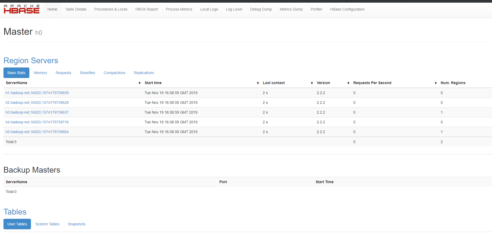
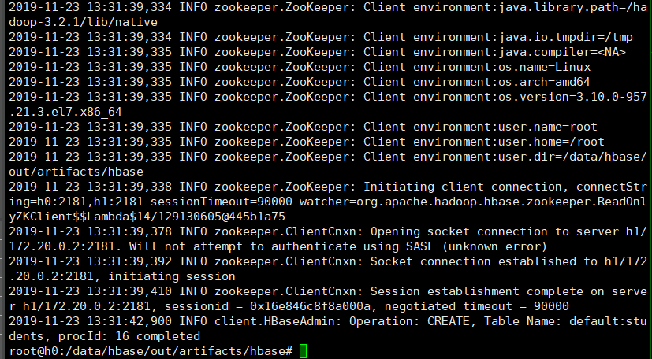

# 作业6

## 1. HBase搭建

因为之间一直使用的是集群模式，故这里直接在之前docke镜像的基础上直接又做了一层封装，部署集群模式的HBase，具体先构建Dockerfile如下：

```dockerfile
FROM hadoop_3
MAINTAINER While

ADD hbase-2.2.2-bin.tar.gz /

ENV HBASE_HOME /hbase-2.2.2
ENV PATH ${PATH}:$HBASE_HOME/bin
```

其中hadoop_3是我之前本地构建好的hadoop集群模式镜像。将其通过`docker build -t hadoop_4 .`之后再直接生成容器进入后修改配置文件，最后通过`docker commit`指令生成配置好的镜像（主要还是直接在dockerfile里改文件内容有点难和麻烦……）

主要修改了`hbase-site.xml`如下：

```xml
<configuration>
        <property>
                <name>hbase.zookeeper.quorum</name>
                <value>h0,h1</value>
        </property>
        <property>
                <name>hbase.rootdir</name>
                <value>hdfs://h0:9000/hbase</value>
        </property>
        <property>
                <name>hbase.cluster.distributed</name>
                <value>true</value>
        </property>
        <property>
                <name>hbase.unsafe.stream.capability.enforce</name>
                <value>false</value>
        </property>
</configuration>
```

## 2. 搭建中遇到的问题

### 2.1 hdfs路径设置错误

 报错如下：
 T.png) 

检查发现是hdfs中路径地址设置错误，参考教程上`hdfs://`打成了`hdfs:/`.

### 2.2 错误如下：


百度后给出了最简单粗暴的一种方法是添加配置：

```xml
        <property>
                <name>hbase.unsafe.stream.capability.enforce</name>
                <value>false</value>
        </property>
```

即可绕过该报错直接解决。其他解决方法暂时未知。

最后通过在启动容器时添加端口映射后可以正常访问HBase的ui界面：



## 3. HBase Shell下建表：

直接参考PPT上命令即可建表如下：


最终`scan`结果如上。

## 4. Java下建表

PPT上教程为HBase1.X版本的API，实际上已被弃用，故专门换用了新版本的API接口。

具体代码见`src\main\java\main.java`文件


开发环境配置上同样采用比较粗暴的方法：在本地idea导入jar依赖包进行编码，之后打包生成jar通过depoloyment远程部署到docker中，最后在容器中执行。


其中遇到的一个问题是用hadoop执行时没有hbase相关依赖包，报`java.lang.NoClassDefFoundError`错误,设置了`CLASSPATH`环境变量之后也无法解决。

Google之后发现hadoop有其`HADOOP_CLASSPATH`环境变量，将其设为`hbase-2.2.2\lib\*`之后就可以直接运行了。


最终执行效果如下：



在HBase Shell中查看效果如下：

