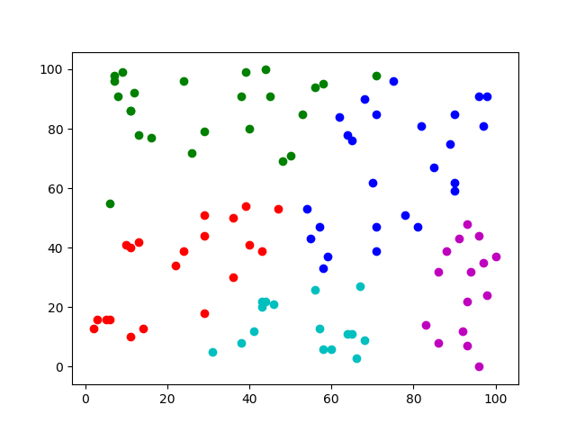
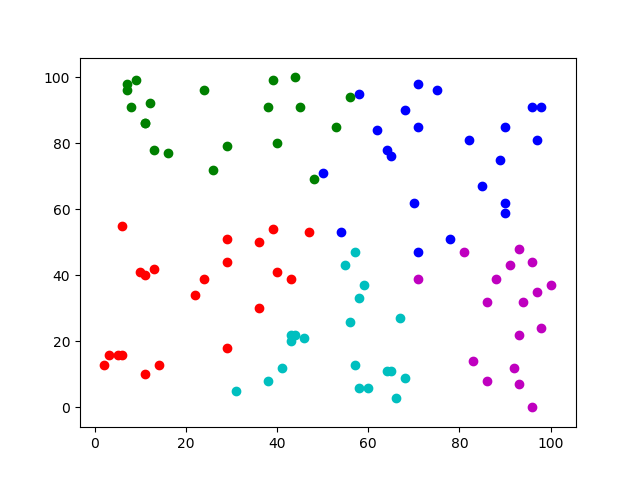
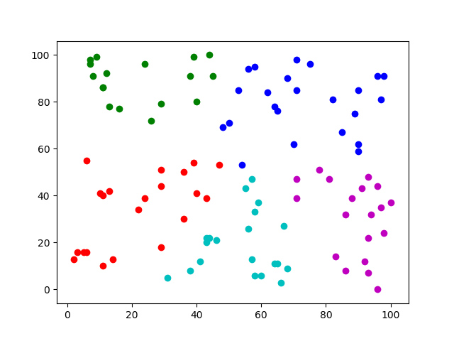
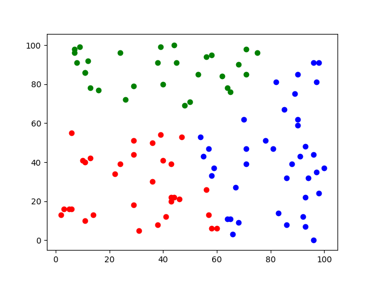
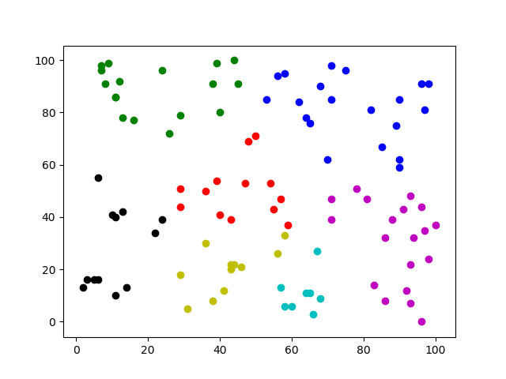
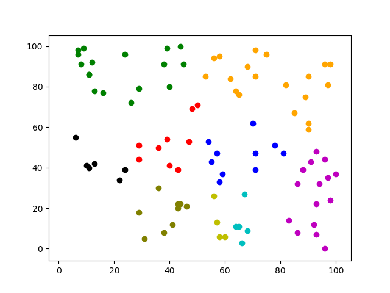

# 金融大数据处理技术 作业5

## 1. 代码实现

直接使用了课本提供的示例代码，位于`src/main/java`目录下；

阅读代码可知，其第一个参数为类别数，第二个参数为迭代轮数，第三第四个参数分别为输入输出地址；

在随机生成初始类簇的部分`RandomClusterGenerator.java`中，出于观察不同迭代轮数的效果的目的，同时考虑到Kmeans算法本身对初始值敏感的特性，故认为设定了随机数种子为521，从而使每次随机初始化的效果相同，直接调整轮数这一参数观察对比不同轮数的结果。

画图展示使用python中matplotlib实现，位于`plot.py`文件中

## 2. 效果对比

### 调整轮数

首先控制类别数为5类，调整迭代次数，发现在5轮时就已收敛：

下图为第1轮时：

下图为第3轮时：

下图为第5轮时：

下图为第十轮时，已和第五轮完全相同：

### 调整类数

之后控制迭代轮数为10，调整类数，效果如下：

下图为分为三类时：

下图为分为五类时：

下图为分为七类时：

下图为分为十类时：
