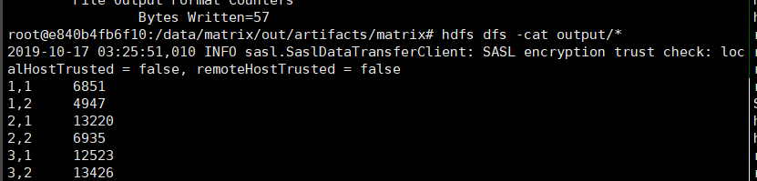

# 金融大数据处理技术 作业4

## 0. 开发环境配置

考虑到结合使用IDE的方便性与配置IDE的复杂耗时性（以及我个人习惯了不借助调试功能Debug，对调试没有强烈需求）我采用了一种比较折衷的方法：在本机IDEA中编写代码、生成Jar包并同步至服务器，服务器再在容器中运行Jar包。具体配置过程大致如下：

- 直接从容器中拷贝（FTP）hadoop安装文件夹下share/hadoop文件夹到本机中
- 在IDEA中配置Project Structure将拷贝来的文件夹中所有Jar包目录加入Modules的Dependencies中
- 设置Deployment,将项目文件直接通过SFTP（容器22端口映射在宿主机上）传输到容器中
- 设置Project Structure中的Artifacts生成Jar包

最终我的调试都是通过直接在容器运行时print或输出到文件里进行的……

## 1. 项目文件结构

因为是Maven直接生成的模板，故文件夹层次较多…

主程序源码在`src\main\java`文件夹下，其中：

- `controller.java`是主函数，负责解析指令调用其他函数执行不同功能，以及输入参数的简单检验，出错时打印帮助信息
- `multiply`包下是矩阵乘法运算的代码
- `relation`包下是关系代数运算的代码
  - 选择运算：Selection
  - 投影运算：Projection
  - 并运算：Union
  - 交运算：Intersection
  - 差运算：Difference
  - 自然连接：NaturalJoin

生成Jar文件的配置文件为`META-INF/MANIFEST.MF`

输出Jar文件在`out/artifacts/matrix`文件夹下生成


## 1.5 参数输入规则

模仿Hadoop示例代码的运行参数要求，约定第一个参数为选择要执行的运算名，后续参数为传入该运算的参数，具体参数使用方法如下：


> Usage: 
> 	mul <inputPathM> <inputPathN> <outputPath>
> 	select <inputPath> <outputPath> <Column name> <operator> <value>
> 	proj <inputPath> <outputPath> <Column name>
> 	inter <inputPath1> <inputPath2> <outputPath>
> 	union <inputPath1> <inputPath2> <outputPath>
> 	diff <inputPath1> <inputPath2> <outputPath>
> 	natural <inputPath1> <inputPath2> <outputPath> <Column name>


## 2. 矩阵乘法实现

直接套用教材提供的源码，可以直接运行，运行截图如下：





## 3. 关系代数——选择 实现

一开始直接运行会报错，之后读了一遍代码之后发现默认的输入格式就可以支持map、reduce完成选择运算

于是去掉如下注释的两行有画蛇添足嫌疑的代码后就可以正确运行：

```java
...
    
//selectionJob.setInputFormatClass(WholeFileInputFormat.class);
//selectionJob.setOutputFormatClass(TextOutputFormat.class);
FileInputFormat.addInputPath(selectionJob, new Path(args[0]));
FileOutputFormat.setOutputPath(selectionJob, new Path(args[1]));

...
```

此外我还对其输入做了修改，添加运算符参数从而支持等于之外的其他比较运算符，并在`RelationA`类中增添对多种输入类型重载的方法`isSatisfy`，从而可以对各列支持大于、小于、等于、不等于、大于等于、小于等于运算（对字符串类型只有等于和不等于）

最终实际运行效果如下：

选取age=18的数据：


选取age小于18的数据（此处在实际运行时发现bash需要输入转义字符`\<`才能正确读入小于号）：


## 4. 关系代数——投影 实现

为了更方便使用和贴合语义，我将原本示例代码中输入列号指定的方式改为了输入列名指定选取，即重载了`RelationA`的`getCol`方法，同时将Map中参数`col`转为`String`类型

运行效果如下：


## 5. 关系代数——并集 实现

因为教材示例代码中没有并运算，因此我以交运算代码为模板，参考课件上交运算思路实现了并运算（即将交运算“出现2次”的条件改为“出现1次”）。

实际运行结果如下：


## 6. 关系代数——交集 实现

基本上以教材示例代码为主，修改后实现该功能。

具体运行截图如下：


## 7. 关系代数——差集 实现

因为看不懂教材示例代码的思路，直接自己实现了Map和Reduce的逻辑：

- Map生成key为该条记录，value为来源文件名（为了能适应各种文件名输入）的key,value对
- Reduce将存在来源文件名与减数文件名相同的key不予输出

这里遇到一个小问题是对于来源文件名和参数输入减数文件名的不一致：

如输入是`input/Ra.txt`,其是包含一段路径的文件名

而通过`context.getInputSplit().getPath().getname()`获取到的是`Ra.txt`文件名

通过`context.getInputSplit().getPath().to_String()`获取到的则是从`hdfs://...`开始的绝对路径名

考虑到支持输入两个不同路径但同名文件的情况，不能使用`getname()`获取文件名比较；

考虑支持`Ra`和`R`这样存在包含关系的输入，不能直接通过`String.contains()`方法判断；

最后决定用`target.equals(temp.substring(temp.length()-target.length(),temp.length()))`方法截取绝对路径上末尾与输入参数等长的字符串来匹配判断相等的方法判断是否为减数所在文件。

最后运行截图如下：


## 8. 关系代数——自然连接 实现

自然连接同样不太认同示例代码上输入参数、传入Map函数参数的处理方法，因此在其基础上重写了Map函数参数及其逻辑，以及根据需求的输出列顺序修改了Reduce部分输出代码。

Map中根据输入的一行具有属性值数（通过`split()`方法）判断是`RelationA`还是`RelationB`,之后将id作为key,其余属性值拼接一个类型前缀作为value输出

Reduce中根据Map拼接在value中的前缀分类存储，之后两类做笛卡尔积，通过`split()`方法分属性值按序输出

此外同之前一样，我将原本数字指定列变为字符串指定列，重载了`RelationA`和`RelationB`中的`getCol()`和`getValueExcept()`方法实现这一功能；

最终效果如下：


