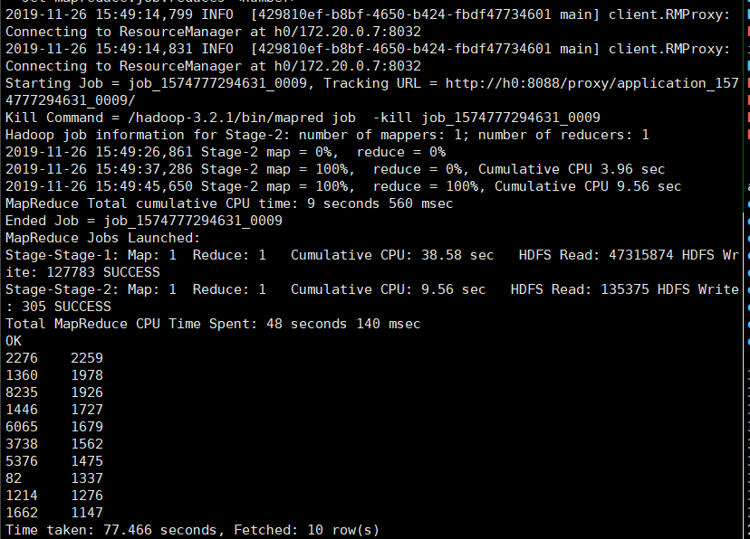

# FBDP 实验三

## 1. 设计思路

### 1.1 精简数据集

观察发现，即使是同一天也存在大量同一用户对同一商品的重复点击、添加购物车、关注等操作（更诡异的是他们的年龄、性别、地址不同），同时考虑我们应关注的是 id人次/天，因此对于同一人的重复点击、添加购物车、关注应只算一次，从而避免重复点击刷点击量一类的影响，或某一商品优惠力度适中引人犹豫却评为受欢迎（考虑真正好的商品或优惠应该引人一次点击就立即下单而非反复点击犹豫）。

而对于购买行为，毕竟是有一定成本的行为，暂时认为可重复计算。


至于同一用户id而省份不同的情况，因不清楚除购买行为外的省份是如何确定的，因此这一部分数据应视为“无省份”，在统计各省排名时除去这一部分数据；而对于同一用户id不同省份的购买行为，考虑会存在如同一个账号给不同的家人、不同收获地址买的情况，应同上保留该部分数据。

所以我的精简数据集将： 买家id 、商品id、 商品类别id 、 卖家id 、 品牌id 、 交易时间:月 、 交易事件:日 、 行为 不为2（购买）的重复且同一省份的数据去除，只记一条，不同省份的则一条都不保留；对于行为为2（购买）的数据，则全部保留。


（不过貌似因此只记id人次导致排名统计数字都不高……）

因此Mapper设计为：

直接发送

- Key: Text类型，用","分割后取前8个字段为Key
- Value: Text类型，直接发送输入的Line

Reducer设计为：

根据Key中第8个字段判断，不为2则判断是否省份都相等，相等的输出1条，不相等的则不输出；

否则为2的全部输出value；

## 1.2 统计前10

直接设定一个参数为筛选list,即排名热门销售产品时输入`"2"`热门关注产品时输入`"0,1,2,3"`

统计前十分我划分为两部分：按商品id统计数量、排序取前10输出

#### 1.2.1 统计数量

Mapper：

根据参数设定的过滤列表过滤后直接发送

- Key: 商品id+”，“+省份
- Value：1

Reducer:

直接统计数量并输出

- Key: 商品id+”，“+省份
- Value: 收到的总数

#### 1.2.2 取Top N

为了便于排序输出，自定义了类型pairWritable，为一个String和一个int的键值对数据，实现WritableComparable接口以便在MapReduce中传输和放入arraylist排序。

此外设置了参数n，外部调用时取n=10实现取前10的效果

Mapper：

封装生成pairWritable并发送

- key:省份
- Value: pairWritable:<商品id+“\t”+省份,总数>

Reducer:

排序并取前n个输出

- key:商品id+“\t”+省份
- value:总数

  
## 2. 代码框架

代码目录位于`million_user\src\main\java`路径下

其中：

- main.java:总调度器，负责设定输入串联多个mapreduce过程，同时参考贝叶斯分类器示例代码删除了中间的临时文件夹
- filter.java: 过滤输入，生成精简数据集
- count.java: 统计计数
- topn.java: 根据各省总数排序并取前n(10)个输出
  - pairWritable.java：定义实现了WritableComparable接口的pair对


# 3. 运行结果

考虑到：

- 数据省份不一的情况可能很普遍

- 同一省份的同id的只记录了1人次
- 记录分布到了各个省份统计

因此最后统计结果貌似都是个位数……


分别运行`hadoop jar million.jar million  million_out "0,1,2,3"`和`hadoop jar million.jar million  million_out1 "2"`得到如下效果：

#### 3.1 购买统计前十


### 3.2 关注前10的产品：


## 4. Hive 搭建

总之经历了各种报错和各种尝试……最后搭成的方案为：

先构建镜像(hadoop_6为之前准备好的hadoop+hbase镜像)：

```Dock	
FROM hadoop_6
MAINTAINER While

ADD apache-hive-3.1.2-bin.tar.gz /

ENV HIVE_HOME /apache-hive-3.1.2-bin
ENV PATH ${PATH}:$HIVE_HOME/bin

CMD ["sh","-c","service ssh start;bash"]
```

因为hive只需要在master节点搭建就可以运行，因此直接以该新镜像启动集群，之后进入master节点进行进一步配置：

1. 从hive-env.sh.templete 复制出hive-env.sh后配置HADOOP_HOME环境变量
2. 从网上找到一个hive-site.xml直接写入该文件：

```xml
<?xml version="1.0" encoding="UTF-8" standalone="no"?>
<?xml-stylesheet type="text/xsl" href="configuration.xsl"?>
<configuration>  
<property>  
  <name>javax.jdo.option.ConnectionURL</name>  
  <value>jdbc:derby:;databaseName=metastore_db;create=true</value>  
</property>  
   
<property>  
  <name>javax.jdo.option.ConnectionDriverName</name>  
  <value>org.apache.derby.jdbc.EmbeddedDriver</value>  
</property>  
   
<property>  
  <name>hive.metastore.local</name>  
  <value>true</value>  
</property>  

<property>  
  <name>hive.metastore.schema.verification</name>  
  <value>false</value>  
</property>  
   
<property>  
  <name>hive.metastore.warehouse.dir</name>  
  <value>/user/hive/warehouse</value>  
</property>  
<property>
    <name>datanucleus.schema.autoCreateAll</name>
    <value>true</value>
</property>
</configuration>  
```

3. 修改hive自带guava版本，即将hadoop中的guava覆盖hive中的guava
4. 最后我也不知道怎么地虽然有一堆warnings但就成功了，也不是很好复现…

最后成功标志：

可以成功进入hive并执行`show databases;`

  

## 5. Hive 操作

### 5.1 建立表

为了方便之后直接导入csv，查询后以如下方式建表：

```mysql
create table logs(
    user_id int,item_id int,cat_id int,mer_id int,brand_id int,month int,day int,action int,age_range int,gender int,province string)
    row format serde 'org.apache.hadoop.hive.serde2.OpenCSVSerde' 
    WITH SERDEPROPERTIES( "separatorChar"="," )  STORED AS TEXTFILE; 
```

### 5.2 导入表

考虑之前筛选过滤很容易过滤掉非常多的数据，这里就直接带入全数据试一遍：

```mysql
load data local inpath './million_user_log.csv' overwrite into table logs; 
```

执行结果如下：


测试导入成功：

```mysql
select count(*) from logs;
```

结果如下：整齐的1000,000条


### 5. 3  查询双11那天有多少人购买了商品 

考虑到数据集即为双十一的数据集，故在日期上不需过多限定;

而这里要求是计数”多少人“,因此需要以user_id为计数单位：

```mysql
select count(distinct user_id) from logs where action=2;
```

执行结果如下：共37202人


### 5.4  查询双11那天男女买家购买商品的比例 

构建语句如下：

```mysql
select gender,count(distinct user_id) from logs where action=2 group by gender;
```

执行效果如下：


发现三种性别的人购买量上惊人地一致。

男女买家比例为22413:22477

### 5.5  查询双11那天浏览次数前十的品牌 

构建查询语句如下：

```mysql
select  brand_id ,count(distinct user_id) num from logs where action=0 group by brand_id order by num desc limit 10 ;
```

执行结果如下：

