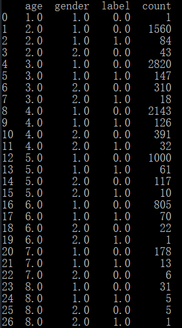
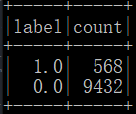
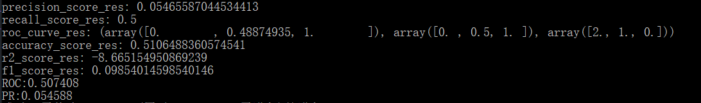
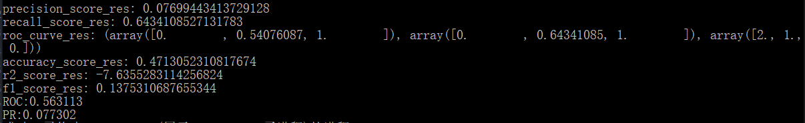
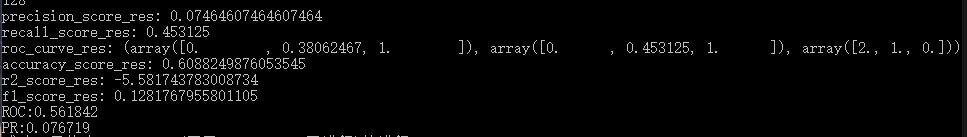
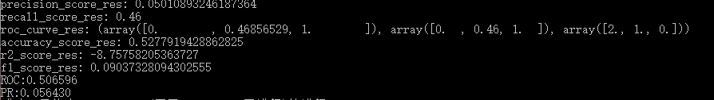
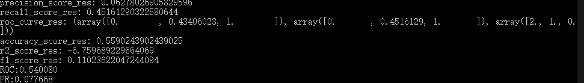
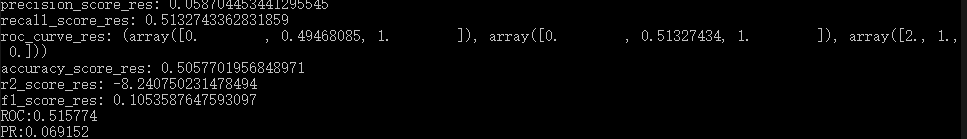
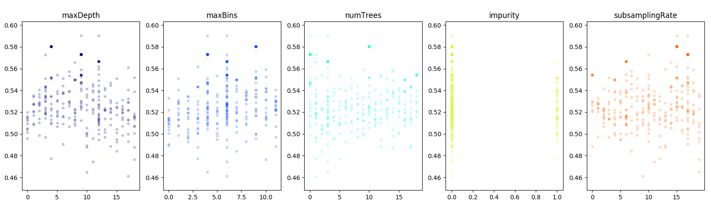
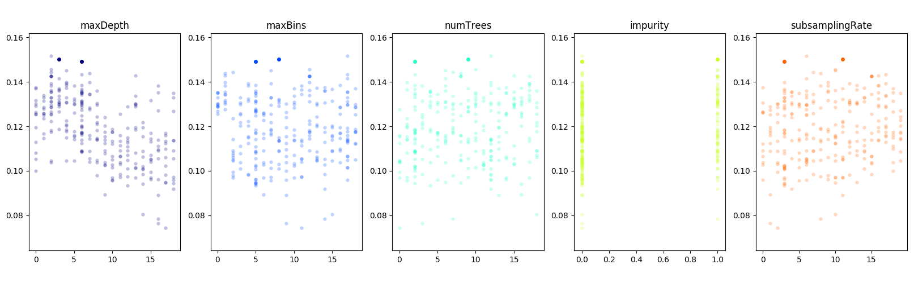

# 实验三 阶段四

## 1. 对数据的分析

观察可知，一共只提供了4个维度的数据：用户id、店家id、用户性别和用户年龄；其中包含的信息十分有限。

因此考虑加入之前双十一100万条数据中的信息辅助，对每个用户和店家提供更多维度（如所在省份、之前购物偏好、店家主营产品类别等）的特征提升预测准确性。然而将100万条数据和训练集做右外连接后统计发现训练集总共10000条数据，其中8990条的user_id在双十一百万条数据集中未出现；其中9432条merchant_id未出现。也就是说训练集中的id基本上都是全新的id,之前训练集完全无法针对具体id提供更多的信息。

在此之外还考虑过不依靠具体到id的信息，如只通过100万条数据训练出根据店家id判断主营产品类别等信息的底层分类器作为辅助；但是分析后发现实际商品类别高达1085种，而且猜想本身id并不像学号一样具有语义，很可能是像qq号一般与注册时间相关的id,因此可想而知这样的分类器也不会预测的准，无法提供有效的信息。

因此最终放弃了对之前100万条记录中信息的利用，硬着头皮直接用训练集中数据了。

------------------------------

聚焦于训练集中的数据，其中两个id维度可以猜测基本无法提供有效信息，但性别和年龄(数据集中只有1和2)最多只有8*2=16种组合，可想而知只依靠这两维遍历便可以求出最优的划分结果，且结合数据可知该分类结果的性能是非常局限的：

因此不得不引入user_id和merchant_id以区分同一性别和年龄区间的人，并且期望能挖掘出id背后有可能存在的一些规律。

另一方面，数据集类别是非常不均衡的：

正负类样本比例为1:16.6，因此直接放入学习很容易出现忽视少数类别的情况，即得到的分类器全部或绝大多数都预测为0，这样便可以有94.32%的准确度，但实际是毫无应用的意义的。因此需特别处理，具体而言,我做出如下两种调整：

- 使用oversampling过采样，即每次随机抽568个负类（label=0）样本和全部正类样本组合，重复多次构建一个正负类为1:1的总数量约和原来相同为1000条的训练集；
- 评价指标使用ROC图的AUC指标和F1得分两个专门考虑类别不均衡情况下常用的指标作为模型的评判标准，如此得到的模型会坚固精确度和召回率，而不是一味追求准确度，更具有实际应用的意义。

## 2. 检验方式

随机取80%为训练集，做上述过采样处理得到均衡训练集；取剩余20%为测试集；

评价指标为测试集上ROC图的AUC指标和F1得分两个指标，主要以F1得分为主；

## 3. 超参数的选择

超参数使用python中hyperopt包使用TPE算法进行自动调参和优化，最后针对每个超参数的取值使用matplotlib绘图可视化展示，其中横轴为超参数取值，纵轴为目标值模型评估值。

## 4. 特征编码方式

对于user_id和merchant_id，直接转为float加入；对于年龄段和性别，有两种方式：

- 直接以浮点数的形式放入
- 以onehot编码方式加入，顺便可以扩充维度

对于这两种方法，以默认参数的GBTClassifier和RandomForestClassifier尝试后发现效果上并没有显著的区别：

#### 直接放入，GBTClassifier

#### 直接放入，RandomForestClassifier

#### Onehot编码，GBTClassifier

#### Onehot编码，RandomForestClassifier

即：基本上没有带来质变，且效果会因模型而异，最终决定不用Onehot编码，直接带入。

## 5. 模型选择

因为基于spark.ml库而非mllib库编写的预处理程序，因此只使用了ml库中的机器学习模型，而没有用只在mllib中的SVM等模型。

具体尝试使用了：LogisticRegression、RandomForestClassifier、GBTClassifier、 NaiveBayes 四种模型；

决策树包含在随机森林中，因此不单独尝试决策树模型；

这里先只使用默认超参数依次进行尝试：

#### LogisticRegression

#### GBTClassifier

#### RandomForestClassifier

#### NaiveBayes 

即：

|   模型名   | 准确度 | 精确度 | 召回率 |  F1  | AUC  |
| :--------: | :----: | :----: | :----: | :--: | :--: |
|  逻辑回归  | 55.9%  |  6.3%  | 45.2%  | 0.11 | 0.54 |
| GBT分类器  | 51.1%  |  5.5%  | 50.0%  | 0.10 | 0.51 |
|  随机森林  | 47.1%  |  7.7%  | 64.3%  | 0.14 | 0.56 |
| 朴素贝叶斯 | 50.6%  |  5.9%  | 51.3%  | 0.11 | 0.51 |

总之可以看出~~基本上都与随机瞎猜相差不大~~与预期一样模型还是很有提升的空间的。因为是类别不均衡数据集，因此忽视准确度，更应关注F1和AUC指标，可以看出随机森林效果最好，逻辑回归次之，因此之后只针对随机森林进行进一步调参。

## Hyperopt调参结果

对于其共有5个参数设置为超参数：

- maxDepth:最大树深度，取值为1~20的整数
- maxBins: 连续特征离散化的最大分箱 ，设取值为8~100，步长为8的整数
- numTrees：随机森林中树的数量，取值为1~20的整数
- impurity：信息准则，取值为信息熵和基尼指数
- subsamplingRate： 用于训练每颗决策树的样本个数 ，取值为0~1，步长为0.05

分别尝试用AUC和F1指标为优化目标，最终结果如下：

#### AUC:

#### F1:

可以看到经过调参之后，最优的AUC可以达到0.59左右；F1得分可以达到0.16左右，有一定程度上的提升。

（图中每个点为一次调参的尝试，颜色愈深代表在该点搜索次数愈多）

