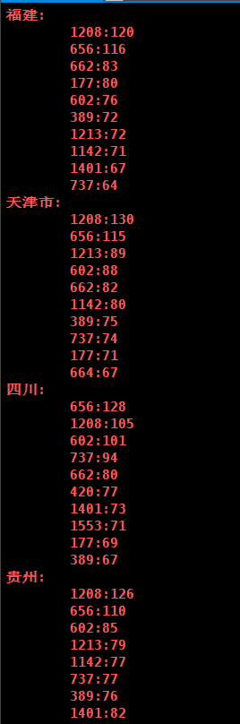

# 实验三 任务三

## 1. 环境搭建

偷懒直接使用了助教提供的spark镜像，在运行参数上增加mount参数，挂在本机已有的数据集文件夹到容器中；此外在开启容器后还安装python3和pyspark包以使用python进行spark的开发；

具体而言，pull到镜像之后运行：

```shell
docker run -it --network hadoop-net -h "h01" --name "h01" -p 9870:9870 -p 8088:8088 -p 8080:8080 --mount type=bind,source=/home/while/share,targetcn-hangzhou.aliyuncs.com/fbdp2019-hadoop/hadoop:2.0.0 /bin/bash
```

之后进入容器后除启动start_all.sh后还执行了：

```shell
apt-get update
apt install python3-pip
pip install pyspark
ln -s /usr/bin/python3 /usr/bin/python
```

最后只需写好python文件后执行

```shell
spark-submit spark_count.py
```

即可运行程序。

## 2.  统计各省销售最好的产品类别前十（销售最多前10的产品类别） 

发现这个其实和后一问是同一个问题，因此预留好参数指定是统计产品类别还是产品的销量。

为了与前后spark的输出信息相区分，设置python输出高亮为红色。

设计思路为先过一层filter筛去行为不为2，即购买的记录；之后经过map以省份+产品类别为key,1为value生成键值对在reduce中进行求和；最后再经map以省份为key,产品类别和购买数的二元组为value经groupbykey后再经map把每一省份的记录排序后取前10输出为value，得到结果。

部分结果如下：





## 3.  统计各省的双十一前十热门销售产品（购买最多前10的产品）-- 和MapReduce作业对比结果 

内容和前一问相同，只是将产品类别换成产品id,部分结果如下，经对比与MapReduce作业相同：


## 4.  查询双11那天浏览次数前十的品牌 -- 和Hive作业对比结果 

考虑到使用spark和sql交互的话基本上可以直接复用Hive作业中的sql语句，且原理上是完全相同的，因此这里换用pyspark编程实现。

设计思路为：

首先经过一个filter过滤掉行为不为0（浏览）的记录，之后经过map生成（品牌，用户）键值对并去掉所有重复的(与Hive作业中预处理相同)；之后直接调用countByKey按品牌计数并输出即可。

运行结果如下：


与Hive作业对比相同。

